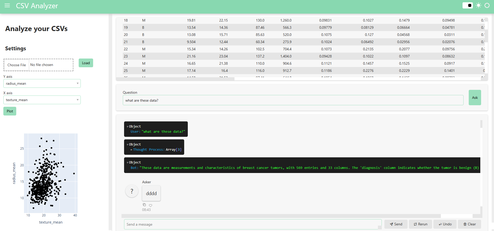

## Run

```sh
python3 analyzer.py
```

## Interface



## Data Engineering
> You can ask questions about data correlations.

> You can visualize any data you want

## Features
This project is intended to showcase our internal tools. We will add more and more features as time goes by.